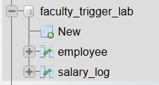
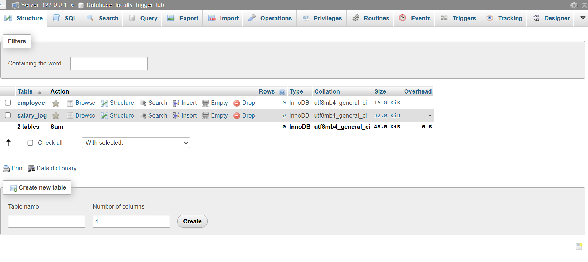
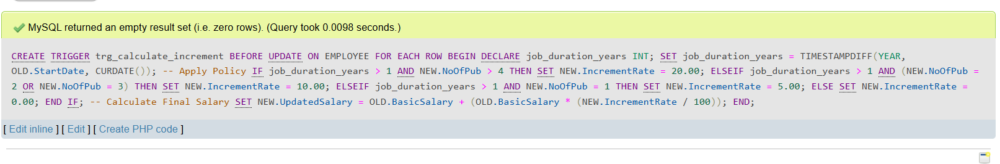
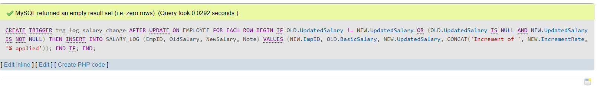
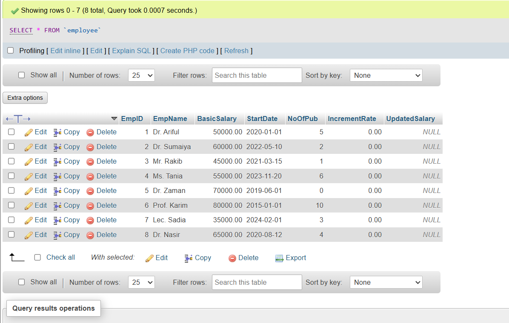
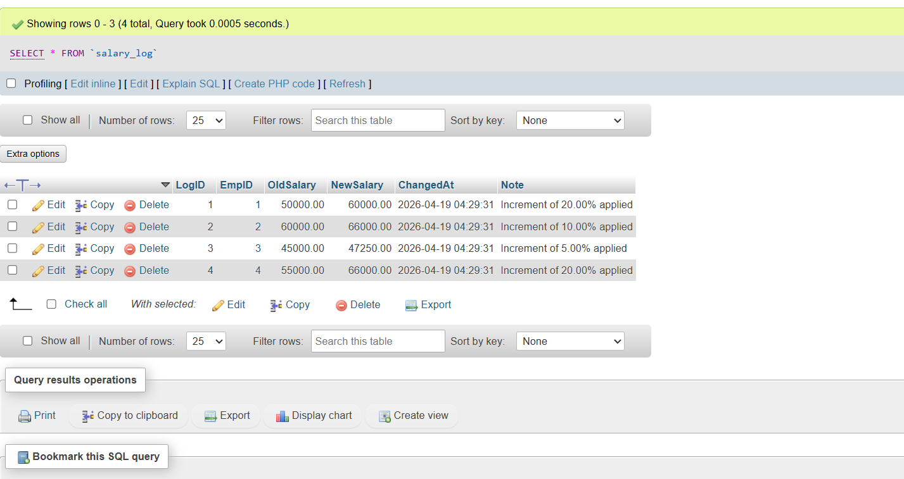
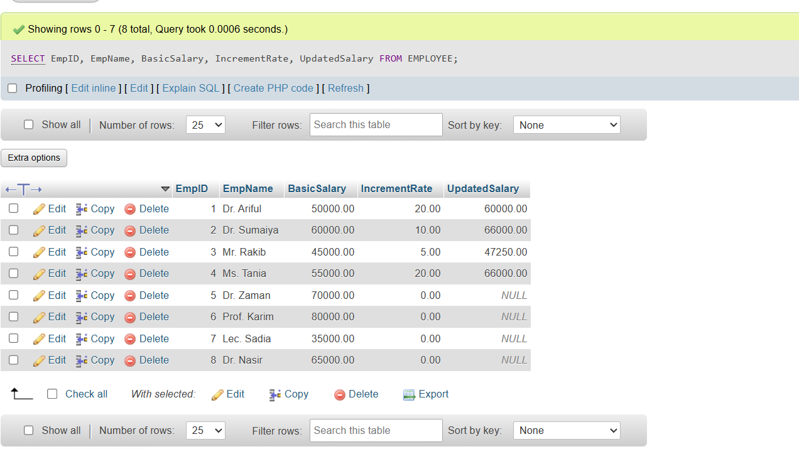
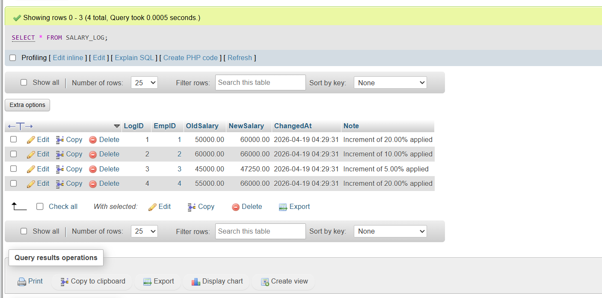

# Faculty-Salary-Trigger-System
An automated SQL database system that manages faculty increments and audit logging using database triggers.

## Features
- **Automated Calculations:** Uses a `BEFORE UPDATE` trigger to calculate salary raises based on tenure and publication count.
- **Audit Logging:** Uses an `AFTER UPDATE` trigger to track every salary change in a separate log table.
- **Data Integrity:** Implements constraints to ensure valid data entry.

## Increment Policy
- **20% Raise:** Service > 1 year AND Publications > 4.
- **10% Raise:** Service > 1 year AND Publications = 2 or 3.
- **5% Raise:** Service > 1 year AND Publications = 1.
- **0% Raise:** Less than 1 year of service OR 0 publications.

##  Implementation & Screenshots

### 1. Database & Table Creation

.

.

## 2.Before after update triggers

.

.

### 3. Data Insert

### 4. Final verification

-------

